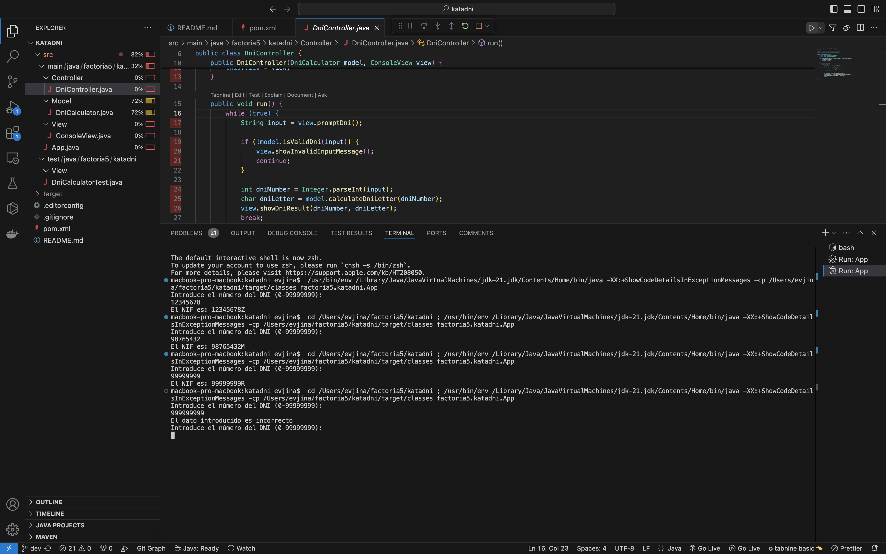

# Kata-DNI
# Descripcíon
Modula una aplicación de consola que calcule la letra del DNI (Documento nacional de identidad).

El algoritmo para calcular la letra del DNI es el siguiente :
El número debe ser entre 0 y 99999999
Tomamos el número completo de hasta 8 cifras de nuestro DNI, lo dividimos entre 23 y nos quedamos con el resto de dicha división (módulo 23)
Según el resultado, de 0 a 22, le corresponderá una letra de las siguientes:  (T, R, W, A, G, M, Y, F, P, D, X, B, N, J, Z, S, Q, V, H, L, C, K, E)
Si el dato introducido no es un número deberá indicarse con un mensaje que "el dato introducido es incorrecto" y volver a preguntar.
Deberá de repetirse el proceso hasta que el usuario introduzca un número válido.
# Requisitos:
Se deberá realizar tests unitarios (coverage mínimo 70%)
# Entregables:
Repositorio de GitHub (enlace): 
https://github.com/vyushkevich/Kata-DNI

Captura de pantalla de la sección "Testing" de visual studio code donde se aprecia el coverage de los tests
